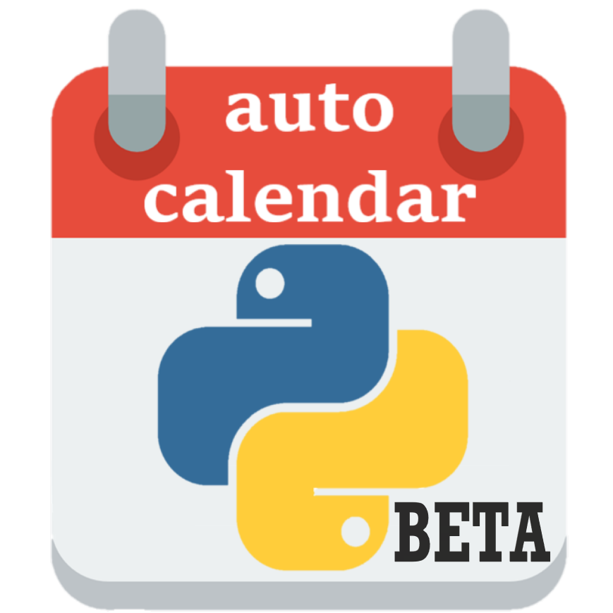

<i> Aviv Drori, May 2021 </i> 

Automatic calendar, with google API. 
<b>What does it do?</b> 
Uses Google Calendar API to <i>get events</i> from a public calendar.  
<i>Parses</i> the info to start&end times, event name, and elapsed time.  
<i>Filters</i> the events so that only critical events are written. 
<i>Writes</i> the events to a pre-formatted excel spreadsheet.  
<i>Still a work in progress!</i>

